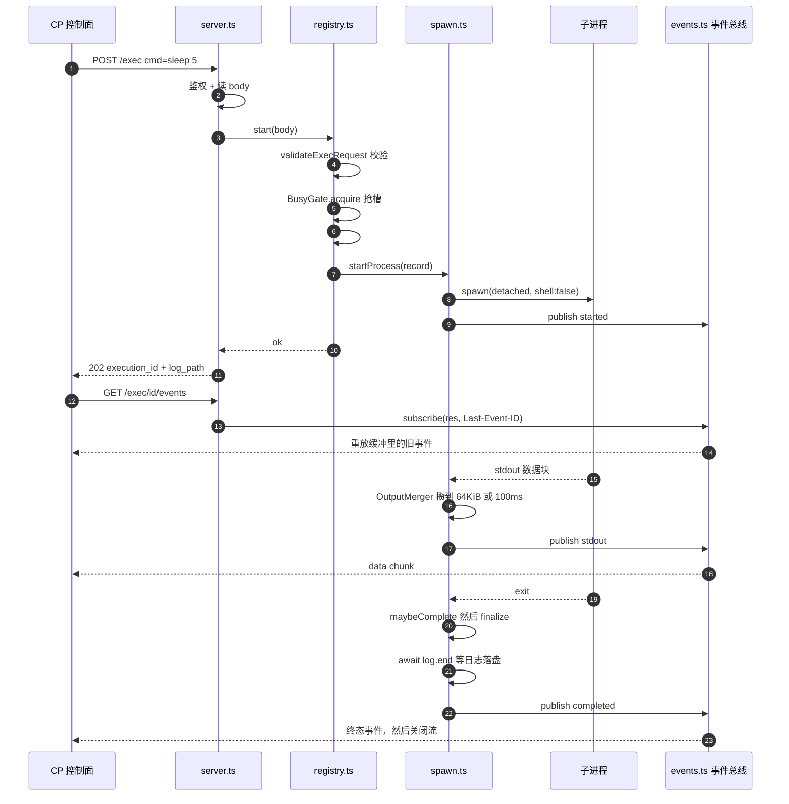

# 一次 exec 的大白话链路

配套阅读：`docs/typescript-速查.md`（看不懂 TS 语法时查它）、`docs/sandbox.md`（完整设计文档）、`docs/sandbox-spec.md`（实施 spec）。

**先声明一件事**：这个仓库现在**只有沙箱侧**（`packages/sandbox-agent`）。文中反复出现的 "CP"（Control Plane，控制面）目前还不存在，它是 spec 里的 Phase 8–12。所以本文里的 CP 你要理解成"将来会来调这个 HTTP 接口的那个程序"。

---

## 0. 一句话说清这东西是干嘛的

**sandbox-agent 是一个跑在沙箱容器里的小 HTTP 服务，唯一的工作是"帮你执行命令 + 读写工作区里的文件，并把过程实时汇报出去"。**

它不思考、不决策、不认识模型。exec 那半边四条：

| 你想干的事 | 调它 |
|---|---|
| 你还好吗 | `GET /health` |
| 跑一条命令 | `POST /exec` |
| 把这条命令的实时输出给我（长连接，不断线） | `GET /exec/{id}/events` |
| 别跑了，停 | `POST /exec/{id}/kill` |

Phase 2 又加了文件那半边三条（往沙箱里灌 tar、读回日志/patch、列目录）：

| 你想干的事 | 调它 |
|---|---|
| 读一个文件（JSON 内联，或 `raw=1` 流式） | `GET /files?path=&offset=&limit=&encoding=&raw=1` |
| 写一个文件（body 就是裸字节，边写边算 sha256） | `PUT /files?path=` |
| 列一个目录 | `GET /files/list?path=&depth=` |

文件 API 的细节（读多根/写单根、1 MiB 内联上限、原子 rename、symlink 不跟随）在
`docs/sandbox-spec.md` 的 Phase 2，以及 `src/paths.ts` / `src/files/*.ts` 的头注释里。
本文只讲 exec 那条链路——文件 API 是另一条链路，混进来会把这张图弄糊。

所有请求都要带 `Authorization: Bearer <token>`——包括 `/health`。别觉得本机跑没用，容器化之后这是内网唯一的门锁。

**它最核心的一个设计决定**：`POST /exec` **不等命令跑完就返回**。返回 202 + 一个 id，然后你拿着 id 去开一条 SSE 长连接收输出。为什么？见 §6 的 Q1。

---

## 1. 全景图：谁跟谁说话

```
        ┌──────────────────────────────┐
        │ CP（控制面，尚未实现）        │
        │  - 决定跑什么命令             │
        │  - 把输出喂给模型             │
        └───────────┬──────────────────┘
                    │ HTTP + SSE（带 Bearer token）
                    ▼
        ┌──────────────────────────────┐
        │ sandbox-agent（这个仓库）     │
        │  server.ts      收请求        │
        │  exec/registry 记状态+闸      │
        │  exec/spawn    起进程+接线    │
        │  exec/events   事件总线/SSE   │
        └───────────┬──────────────────┘
                    │ spawn(argv)  进程组
                    ▼
        ┌──────────────────────────────┐
        │ 真正的命令（npm test / git …）│
        │  stdout / stderr → 管道       │
        └──────────────────────────────┘
```

三条链路各自独立，读代码时不要混：

1. **控制链路**：HTTP 请求进来 → `server.ts` → `registry.ts` → `spawn.ts` → 进程起来
2. **输出链路**：进程 stdout/stderr → 合并器 → 事件总线 → SSE 出去
3. **收尾链路**：进程退出/被杀 → `maybeComplete` → `finalize` → 终态事件 + 释放槽



---

## 2. 启动链路：从 `node src/index.ts` 到能接请求

入口是 `src/index.ts` 的 `main()`，一共五步：

```
main()  [index.ts]
 ├─ 1. loadConfig()                    [config.ts]
 │     读环境变量 → Config 对象。
 │     没有 SANDBOX_AGENT_TOKEN 直接抛异常 → 顶层 catch → 打印 + exit(1)。
 │     这是刻意的：镜像里有默认 token = 所有沙箱共用一个公开凭据。
 │
 ├─ 2. mkdir LOG_ROOT / HOME
 │     日志目录必须先存在，因为 registry 建记录时就要 open 日志文件。
 │
 ├─ 3. createRootResolver(WORKSPACE_ROOT)   [paths.ts]
 │     建目录 + 把 realpath 后的根缓存起来。
 │     为什么要 realpath：macOS 上 /tmp 其实是 /private/tmp 的符号链接，
 │     不做这一步，后面所有"路径是否在根之内"的判断全会错。
 │
 ├─ 4. new ExecutionRegistry(config, roots)  [exec/registry.ts]
 │     里面就一个 Map（状态表）+ 一个 BusyGate（并发闸）。
 │     注意：它此刻是空的，什么也不做。
 │
 └─ 5. createAgentServer(config, registry) → listen(port, host)
       把 server 建好并监听。到这里才能接请求。
```

之后的整个进程生命里，**所有事情都是从 HTTP 回调里开始的**，不会再回到 `index.ts`。
（除了信号：SIGTERM / SIGINT 会触发 `shutdown`，见 §4.6。）

---

## 3. 主线：一次 `/exec` 的完整旅程

假设 CP 发来：

```json
{ "cmd": ["bash","-lc","echo hi; sleep 1; echo bye"] }
```

### 阶段一：受理（毫秒级，同步完成）

```
[1] server.ts · createAgentServer 里的那个匿名回调
      ↓
[2] server.ts · handle(req, res, config, registry)
      ├─ isAuthorized(...)  → 不对就 401，连 /health 也一样
      ├─ new URL(req.url)   → 取出 pathname
      └─ 路由匹配到 POST /exec
      ↓
[3] server.ts · readJsonBody(req)
      一点一点把请求体读完（上限 256 KiB，超了 413），JSON.parse。
      注意：它只保证"是合法 JSON"，不保证字段对不对。
      ↓
[4] registry.ts · ExecutionRegistry.start(body)
      ├─ 正在优雅退出？→ 503
      ├─ spawn.ts · validateExecRequest(raw, config, roots)   ← 唯一的校验点
      │    ├─ body 是普通对象吗
      │    ├─ cmd 是非空字符串数组吗（每个元素都查、还查 NUL 字节）
      │    ├─ cwd：paths.ts 的 roots.resolve() → 越界 → 400 path_out_of_bounds
      │    ├─ env：只能 string → string
      │    └─ timeoutMs / maxOutputBytes：范围检查，默认值补齐
      │  失败 → 400 + 稳定的错误码（CP 靠这个码分支，不靠猜）
      ├─ id = `exe_${ulid()}`                        ← ulid.ts
      ├─ gate.acquire(id)  → 抢不到 → 409 {error:"busy", activeExecution}
      ├─ #createRecord(id, request)
      │    ├─ logPath = {logRoot}/{id}.log
      │    ├─ new EventBus(logPath, ...)      ← events.ts
      │    ├─ new LogFile({path, maxBytes, onError, onTruncated})  ← logfile.ts
      │    │    注意 onError/onTruncated 里用的是 publishIfOpen：
      │    │    因为日志的错误可能晚到（终态之后），那时总线已经关了，直接 publish 会抛
      │    ├─ 造一个 finished Promise（resolve 函数存起来，收尾时才调）
      │    └─ onFinish = () => gate.release(id)   ← 记住这行，它就是"解锁"的地方
      ├─ #executions.set(id, record)     ← 先入库，再起进程
      └─ startProcess(record, config)    ← 进阶段二
      ↓
[5] server.ts · sendJson(res, 202, {execution_id, log_path})
```

**到这一步，HTTP 请求就结束了。** 命令可能还在跑，也可能已经失败了——真正的结果在事件流里。

> 这里有个细节值得多看一眼：`#executions.set(id, record)` 必须发生在 `startProcess` **之前**。
> 因为 `startProcess` 会立刻发 `started` 事件，而此时如果有 SSE 已经连上来，它得能查到这条记录，否则会 404。

### 阶段二：起进程 + 接线（`spawn.ts · startProcess`）

```
[6] spawn(record.cmd[0], record.cmd.slice(1), {
        cwd: record.cwd,
        env: buildEnv(record.env, config),   ← 固定最小集合 + 请求里的 env
        detached: true,     ← 关键：让子进程成为进程组组长（setsid）
        stdio: ["ignore","pipe","pipe"],
        shell: false,       ← 关键：没有隐式 shell
    })
        │
        ├─ 同步抛异常（比如 cwd 不存在）→ record.spawnError = ... → finalize → 终态 failed
        └─ 成功 → 继续 ↓

[7] record.pid = child.pid
[8] bus.publish("started", {execution_id, pid, ts, cwd, cmd})
        ← CP 最早收到的永远是这条。它是"命令真的起来了"的信号。

[9] 建两个 OutputMerger（一个 stdout 一个 stderr，不能合）
        回调： (text, bytes) => emitChunk(record, "stdout", text, bytes)

[10] 挂四个监听器（接线完成）：
     stdout 'data' →  ① record.stdoutBytes += 长度
                      ② record.log.write(buf)          ← 完整内容进日志
                      ③ out.push(buf)                  ← 合并后进事件流
     stderr 'data' →  同样三件事（各自计数、同一个日志文件、err 合并器）
     stdout 'end'  →  stdoutEnded = true → maybeComplete
     stderr 'end'  →  stderrEnded = true → maybeComplete
     child  'error'→  ENOENT 走这里（spawn 本身不抛！）→ spawnError → finalize
     child  'exit' →  childExited = true, 记 exitCode/signal → maybeComplete

[11] 安排超时定时器（如果 timeoutMs > 0）→ 到点调 requestKill(record, "timeout")
```

**从这一刻起，`startProcess` 就返回了，它对剩下的进程生命不再有控制权**——一切由监听器驱动。

### 阶段三：输出怎么流到 CP（`output.ts` → `events.ts` → SSE）

```
子进程往 stdout 写 "hi\n"
   ↓
child.stdout 的 'data' 事件
   ↓
OutputMerger.push(buf)              [output.ts]
   ├─ 先 flush 再追加（保证单条事件不超过 chunkBytes）
   ├─ decoder.write(buf)  ← StringDecoder 增量解码，跨 chunk 的中文不会变乱码
   └─ 攒着。两种触发方式，先到先发：
        · 攒够 64 KiB → flush
        · 距上次 flush 过了 100ms → 定时器 flush
   ↓ flush 时
onChunk(text, bytes)
   ↓
spawn.ts · emitChunk(record, "stdout", text, bytes)
   ├─ 已经截断过 / 正在收尾？→ 直接丢掉（日志里还是有）
   ├─ 算 remaining = maxOutputBytes - inlineBytes
   ├─ 装不下 → 发能装下的前缀 + 一条 truncated{reason:"output_limit"}  → 之后内容不再进事件流
   └─ 装得下 → inlineBytes += bytes
   ↓
EventBus.publish("stdout", {chunk: text})     [events.ts]
   ├─ id = ++seq      ← 单调递增，重连重放的依据
   ├─ 塞进内存环形缓冲（1000 条 / 1 MiB，先到为准，超了淘汰最老的）
   └─ encodeFrame() → 给每个订阅者 write()
        id: 7
        event: stdout
        data: {"chunk":"hi\n"}
        ␣                        ← 空行才是帧结束符
   ↓
Subscriber.write → res.write(frame) → CP 收到
```

> **顺手记两个"别去修它"的事**：
> 1. stdout 和 stderr 之间**不保证顺序**。它们是两个独立的 OS 管道，OS 层面本来就不保证。同一条流内部才是有序的。
> 2. 日志文件里两路是**交错**的、无标记的——就是你在终端里看到的样子。要看分流的字节数，看终态事件里的 `stdout_bytes` / `stderr_bytes`。

### 阶段四：结束（`maybeComplete` → `finalize`）

```
子进程 exit
   ↓
'exit' 监听器： childExited = true
   ↓
maybeComplete(record)      [spawn.ts]
   ├─ 正在收尾 / 已经不是 running？→ 返回
   ├─ 还没 exit？→ 返回（两路管道都 EOF 了也得等 exit）
   ├─ stdoutEnded && stderrEnded 都 true？→ finalize()（这是最常见的路径）
   └─ 否则：启动一个 250ms 的 drain 定时器（exitDrainMs）
        到点：合并器 end() → 强拆 stdout/stderr 读端 → finalize()
        ★ 这个宽限期是给"后台进程继承了管道写端"准备的，见 §6 的 Q5
   ↓
finalize(record)           [spawn.ts]  ← 全链路唯一的收尾函数
   ├─ finishing = true    （幂等锁：exit / error / drain 三条路只可能有一个赢）
   ├─ clearTimers()       清掉超时 / SIGKILL / drain 三个定时器
   ├─ 两个合并器 end()     把 decoder 里残留的半个字符和攒着的内容全部吐出去
   ├─ status = spawnError ? "failed" : (killReason ?? "completed")
   ├─ endedAt = Date.now()
   ├─ await record.log.end()      ★ 等日志落盘！终态事件必须排在所有内容事件之后
   ├─ bus.publish(status, {exit_code, signal, duration_ms, stdout_bytes,
   │                       stderr_bytes, truncated, log_truncated, log_path, ...})
   ├─ bus.close()          → 所有 SSE 连接被 end()，CP 看到流结束
   ├─ record.onFinish()    → gate.release(id) → 沙箱可以接下一个 exec 了
   └─ record.resolveFinished()   → 优雅退出时等的就是它
```

**一个执行的生命周期到这里就绝对结束了。** 记录还留在 Map 里（CP 可能很晚才来查），但状态永远不会再变。

---

## 4. 五条支线链路

### 4.1 超时链路

```
scheduleTimeout(timeoutMs) 到点
   ↓
requestKill(record, "timeout")        [spawn.ts]
   ├─ 已经不是 running / 正在收尾？→ 返回（幂等）
   ├─ killReason = "timeout"   ← 一旦置上就不再变（先发生的终止原因说了算）
   ├─ 取消超时定时器（它已经完成使命了）
   ├─ 把合并器里攒着的输出立刻 flush（不等 100ms 窗口，反正马上要杀了）
   └─ escalateKill(pid, killGraceMs)   [timeout.ts]
        ├─ 立刻：process.kill(-pid, "SIGTERM")  ← 负数 pid = 整个进程组
        └─ 5 秒后：process.kill(-pid, "SIGKILL")（除非中途被 cancel）
   ↓
进程真的死了 → 'exit' → maybeComplete → finalize → status = "timeout"
```

**注意 `requestKill` 不发终态事件。** 发信号 ≠ 进程已死。如果这里就发 `timeout`，CP 会在进程还在写日志的时候去读日志。终态只由 `finalize` 发，且只在进程真的死了之后。

### 4.2 主动 kill 链路

```
POST /exec/{id}/kill
   ↓
server.ts · handleKill
   ↓
registry.ts · kill(id)
   ├─ 没有这个 id → 404
   ├─ 还在 running → requestKill(record, "killed")   ← 上面那条链路，只是原因不同
   └─ 已经是终态 → 什么都不做（幂等！）
   ↓
立即 200 {execution_id, status:"killing"}
```

`status` 的三种取值逻辑：还在跑 → 回 `"killing"`；已经是终态 → 原样回那个终态值（`"completed"` / `"killed"` …）。**重复 kill 不报错**——重试语义需要它。

### 4.3 SSE 重连 / 重放 / 空洞

SSE 断线是常态（网络抖动、CP 重启）。所以：

```
CP 重连：GET /exec/{id}/events   带请求头 Last-Event-ID: 42
   ↓
server.ts · handleEvents → parseLastEventId()
   （不是数字 / 负数 / 空 → 当成"没带"，从头重放。故意宽容，不为此拒绝连接）
   ↓
events.ts · EventBus.subscribe(res, 42)
   ├─ 先 res.writeHead(SSE 头) + setNoDelay + 立刻写一行 ": connected"
   │     ← 先挂监听、先吐一帧，CP 才能区分"连上了"和"还没连上"
   ├─ 关键判断：oldestId = 缓冲里最老那条的 id
   │     · 42 < oldestId - 1  → 你要的那段已经被淘汰了！
   │        发一条 truncated{reason:"replay_gap", from_id:42, log_path}
   │        ★ 这条事件**故意不带 id**——它不是缓冲里的真实事件，编个 id 会污染单调序列
   │     · 否则 → 正常
   ├─ 重放：把缓冲里 id > 42 的事件按序全发一遍（不漏不重）
   └─ 登记订阅者。之后新事件实时推。
```

多个订阅者可以同时挂着（旧连接可能还没断干净）——禁止重连只会让重试逻辑更复杂，所以允许。

### 4.4 截断：三种 `truncated`，三种原因

| reason | 什么时候 | limit | 去哪儿找完整内容 |
|---|---|---|---|
| `output_limit` | 内联事件总量要超过 `maxOutputBytes`（默认 1 MiB） | maxOutputBytes | 日志文件 |
| `log_limit` | 日志文件写到 `maxLogBytes`（默认 256 MiB） | maxLogBytes | 没有完整内容了，只能认了 |
| `replay_gap` | 重连时你要的那段已被缓冲淘汰 | — | 日志文件（部分） |

两条纪律：

- `output_limit` 之后**事件流不再发内容**，但**日志继续写**、**命令继续跑**。
- `log_limit` 之后**日志停止写**，但**命令继续跑**、**事件流继续发**。谁也不许因为"写不下了"就弄死用户的命令。

### 4.5 并发闸（BUSY）

```
第一个 POST /exec  → gate.acquire("exe_A") → ok，activeExecution = "exe_A"
第二个 POST /exec  → gate.acquire("exe_B") → 失败 → 409 {error:"busy", activeExecution:"exe_A"}
...
"exe_A" 收尾 → finalize → onFinish → gate.release("exe_A") → 槽空了
下一个请求可以进来
```

**一个沙箱同时只能跑一个 exec，这是设计，不是临时限制。** 需要并发就开多个沙箱。理由：agent 本身是串行的，多路并发带来输出交错、cwd 竞争、状态歧义，换不来任何产品价值。

`release(id)` 里做了 id 比对：防止一个晚到的旧执行把新执行的槽给释放了。

### 4.6 优雅退出（容器里 `docker stop` 走的就是这条）

```
SIGTERM（或 Ctrl-C 的 SIGINT）
   ↓
index.ts · shutdown(signal)
   ├─ shuttingDown 锁：两个信号几乎同时到也不会跑两遍
   ├─ registry.shutdown()
   │    ├─ #shuttingDown = true（之后的新 /exec 一律 503）
   │    ├─ 对所有 running 的执行 requestKill(record, "killed")
   │    └─ await Promise.all(每个 record.finished)   ← 等日志真的落盘
   │          与一个兜底 deadline（killGraceMs + 1s）赛跑
   ├─ server.closeAllConnections()   ← SSE 长连接会挡住 close()，必须显式拆
   ├─ server.close() 与 1s 超时赛跑
   └─ console.log("stopped") → process.exit(0)
```

顺序是重点：**先杀进程组，再关 server**。反了的话容器里会留下孤儿进程。

为什么必须有这条链路：Docker 停容器是"先 SIGTERM，10 秒后 SIGKILL"。agent 必须在这 10 秒内把自己起的所有进程收干净，否则宿主机上会攒一堆没人管的 `npm` / `node`。

---

## 5. 每个文件扮演谁（一句话版）

| 文件 | 一句话 | 关键导出 |
|---|---|---|
| `src/index.ts` | 启动 + 优雅退出。把四块拼起来，然后等信号 | `main()` |
| `src/config.ts` | 环境变量 → Config。没有默认 token | `loadConfig`, `Config` |
| `src/types.ts` | 对外契约（HTTP/SSE 的形状）。**零逻辑** | 各种 interface |
| `src/ulid.ts` | 生成 `exe_01H...` 这种可排序 id | `ulid()` |
| `src/paths.ts` | 路径包含性校验。所有来自 CP 的路径都要过这里 | `RootResolver.resolve()` |
| `src/server.ts` | 路由 + 鉴权 + 读 body + 发 JSON | `createAgentServer()` |
| `src/exec/registry.ts` | 状态表 + 并发闸 + id 生成 + 收尾等待 | `ExecutionRegistry`, `BusyGate` |
| `src/exec/spawn.ts` | 校验 → spawn → 接线 → 收尾。**风险最高的文件** | `validateExecRequest`, `startProcess`, `requestKill` |
| `src/exec/output.ts` | 把零碎输出攒成 ≤64KiB 的块，顺便处理多字节字符 | `OutputMerger` |
| `src/exec/logfile.ts` | 完整输出落盘，带大小上限和"写失败也不死" | `LogFile` |
| `src/exec/events.ts` | 事件总线：单调 id + 环形缓冲 + 重放 + SSE 编码 + 心跳 | `EventBus` |
| `src/exec/timeout.ts` | 只负责发信号：SIGTERM → 5s → SIGKILL，整组 | `escalateKill`, `scheduleTimeout` |
| `test/harness.ts` | 测试基础设施：进程内起真 agent + 手写 SSE 客户端 | `startTestAgent`, `SseClient`, `runExec` |

**依赖方向**（谁 import 谁，不会有环）：

| 文件 | 被谁使用 |
|---|---|
| `config.ts` | `index.ts` / `server.ts` / `registry.ts` / `spawn.ts` |
| `types.ts` | `server.ts` / `registry.ts` / `spawn.ts` / `events.ts`（只看类型，不产生依赖） |
| `ulid.ts` | 只有 `registry.ts` |
| `paths.ts` | `index.ts` / `registry.ts` / `spawn.ts` |
| `exec/timeout.ts` | `spawn.ts`（发信号） / `registry.ts`（只要类型） |
| `exec/output.ts` | `spawn.ts` |
| `exec/logfile.ts` | `registry.ts` |
| `exec/events.ts` | `registry.ts` / `server.ts` |
| `exec/spawn.ts` | `registry.ts` |
| `exec/registry.ts` | `server.ts` / `index.ts` |
| `server.ts` | `index.ts` |

从上往下就是启动时的组装顺序：`index → server → registry → spawn → output/logfile/timeout`。
一个快速的自检方法：**如果两个文件互相 import，那设计就错了。** 目前没有。

---

## 6. 高频懵点 FAQ

**Q1：为什么 `POST /exec` 立刻返回 202，不直接等命令结果？**
因为命令可能跑几分钟。HTTP 请求挂那么久会踩三种坑：中间代理超时、CP 重启丢连接、模型那边等的其实是 CP 而不是沙箱。所以"受理"和"结果"分开：202 只告诉你"确实开始跑了"（给了 id），结果从 SSE 拿。

**Q2：为什么退出码 1 也算 `completed`？**
因为"命令跑成功了吗"需要业务知识——比如 `npm test` 有失败用例返回 1，但命令本身执行得很正常。沙箱只报告事实（退出码是 1），判断成败是 CP 的事。`failed` 只表示**沙箱自己没能把命令跑起来**（比如 ENOENT）。

**Q3：为什么 `cwd` 不存在是 `failed` 事件，而不是 400？**
两类错误的区别：越界（`../../etc`）是**策略违规**——你请求不合法，改了再来，所以 400。root 之内但磁盘上不存在是**运行期事实**——请求本身合法，只是跑起来才发现，所以 202 + `failed` 事件。这个区分决定了 CP 的错误处理分支，所以代码里专门写了注释提醒不要合并它们。

**Q4：`shell: false` 是什么意思？`["npm","test"]` 和 `"npm test"` 有区别吗？**
有本质区别。`shell: false` 是直接 `execve`，`"npm test"` 里那个空格不会被任何人解释——你写 `["echo","a | b"]` 就真的会打印出 `a | b` 这四个字符，不会触发管道。要管道/通配符就自己显式写 `["bash","-lc","npm test | tee out.txt"]`，**让"要 shell"变成调用方的显式选择**。这一条直接消灭了命令拼接注入这一整类 bug。

**Q5：`nohup ./dev-server &` 之后，为什么不能死等管道 EOF？**
因为后台进程**继承了 stdout 的写端**。管道只要还有任何一个写端开着就不会 EOF——而那个 dev-server 可能开着几天。所以：子进程 exit 之后最多等 250ms（`exitDrainMs`），到点强拆读端、照常发终态。宽限期之后的输出就丢了（它不属于这次执行的结果）。**这正是 `maybeComplete` 里那个 drain 定时器存在的唯一理由。**

**Q6：既然有日志文件，为什么还要事件流？内容不是重复吗？**
它们服务两个不同目的，都不可少：
- **事件流**是通信通道：实时、有预算（会被截断）、断开就没了（只有内存缓冲能重放一点）。
- **日志文件**是取证/持久化：完整、在磁盘上、进程重启也在（只要文件还在）。

终态事件里带 `log_path`，CP 需要全文时去读。`docs/sandbox.md` 有句话说得准：日志文件的角色是持久化存储和事后取证，**不是通信通道**。

**Q7：`detached: true` 不是"分离"吗？为什么又说正常结束不禁子进程？**
`detached` 在这里只有一个目的：**让子进程成为进程组组长**，这样 `process.kill(-pid, sig)` 能一次带走整棵树。它不意味着"结束时要杀掉子进程"。正常结束时（`completed`）后台进程继续活着——这是设计（集成测试要起数据库、要起 dev server），清理交给沙箱销毁。

**Q8：为什么 agent 不继承自己的 `process.env` 给子进程？**
两个理由：**确定性**（测试行为不随宿主机漂移）和**避免泄漏**（`SANDBOX_AGENT_TOKEN` 不可能从环境漏进被执行的命令）。所以 `buildEnv()` 给的是一个固定最小集合（PATH/HOME/LANG/TERM）+ 请求里显式传的 env。

**Q9：为什么事件 id 从 1 开始？为什么 `replay_gap` 那条没有 id？**
id 从 1 开始、单调递增、永不回退（即使缓冲淘汰了它）。重放时客户端说"我收到 42 了"，服务端就发 43 之后的。`replay_gap` 不是缓冲里的真实事件，它只是一条通知——给它编个 id 会破坏"id 单调且连续"这个前提，所以它故意没有 id。

**Q10：改类型会不会影响运行？**
不会。TypeScript 类型在运行时被完全擦除（见 `docs/typescript-速查.md` §0）。`npm run typecheck` 只是检查器。真正挡坏数据的是 `validateExecRequest` 里的手写校验。

**Q11：为什么 `tsc` 通过但测试挂了 / 反过来？**
它们测的是两件事。`tsc` 只看类型自洽（"传参形状对不对"）；测试跑真实行为（"进程真被杀了吗"）。两个都要过。这个仓库有个好处：`npm test` 不需要 Docker、不需要网络，所以本地跑得飞快（49 个用例 3 秒内）。

**Q12：裸跑时 `["node",...]` 报 ENOENT 是怎么回事？**
默认 `SANDBOX_AGENT_BASE_PATH` 里是 `/usr/local/bin` 等（容器里 node 在那儿）。macOS（尤其 Apple Silicon）的 node 通常在 `/opt/homebrew/bin`。裸跑时把这行加上就行：

```bash
SANDBOX_AGENT_BASE_PATH="$PATH"
```

测试脚手架 `test/harness.ts` 就是这么干的（它显式把 `process.env.PATH` 传进去）。

---

## 7. 自己动手走一遍（10 行命令）

```bash
cd /Users/reuben/Documents/cloud-digital-platform
mkdir -p /tmp/rc-demo/ws /tmp/rc-demo/logs /tmp/rc-demo/home

# 起 agent（前台跑着，另开一个终端做下面的 curl）
SANDBOX_AGENT_TOKEN=dev-token \
SANDBOX_AGENT_WORKSPACE_ROOT=/tmp/rc-demo/ws \
SANDBOX_LOG_ROOT=/tmp/rc-demo/logs \
SANDBOX_AGENT_HOME=/tmp/rc-demo/home \
SANDBOX_AGENT_BASE_PATH="$PATH" \
node packages/sandbox-agent/src/index.ts
```

另一个终端：

```bash
T=dev-token

# 1. 就绪探针
curl -s localhost:8080/health -H "authorization: Bearer $T"
# {"status":"ready","version":"0.0.1","activeExecution":null}

# 2. 跑一条 5 秒的命令，拿到 id
curl -s -X POST localhost:8080/exec -H "authorization: Bearer $T" \
  -H 'content-type: application/json' \
  -d '{"cmd":["bash","-lc","echo a; sleep 1; echo b; sleep 4"]}'
# {"execution_id":"exe_01H...","log_path":"/tmp/rc-demo/logs/exe_01H....log"}

# 3. 立刻再发一个 → 409（并发闸生效）
curl -s -X POST localhost:8080/exec -H "authorization: Bearer $T" \
  -H 'content-type: application/json' -d '{"cmd":["true"]}'
# {"error":"busy","activeExecution":"exe_01H..."}

# 4. 接 SSE 看输出（-N 关掉 curl 自己的缓冲，否则你会看到"最后一次性到达"）
curl -N localhost:8080/exec/exe_01H.../events -H "authorization: Bearer $T"

# 5. 另开一个终端重连 + 重放：假设你已经收到 id=2
curl -N localhost:8080/exec/exe_01H.../events -H "authorization: Bearer $T" \
  -H 'Last-Event-ID: 2'

# 6. 提前杀掉
curl -s -X POST localhost:8080/exec/exe_01H.../kill -H "authorization: Bearer $T"
# {"execution_id":"exe_01H...","status":"killing"}

# 7. 终态之后日志文件应该和 stdout_bytes + stderr_bytes 对得上
wc -c /tmp/rc-demo/logs/exe_01H....log
```

**看第 4 步的输出时注意两件事**：一是 `a` 和 `b` 是隔了 1 秒分别到达的（不是最后一起到），二是帧的格式（`id:` / `event:` / `data:` / 空行）。这两点就是整个方案的立身之本。

---

## 8. 测试怎么对应链路（想验证哪一段就去看哪个文件）

spec 的 18 个验收用例，在代码里的落点：

| 用例 | 验的是链路的哪一段 | 文件 |
|---|---|---|
| 1 `completed` / exit_code | 收尾链路 | `exec.test.ts` |
| 2 stdout/stderr 分流 | 输出链路 | `exec.test.ts` |
| 3 立即返回 <100ms | 阶段一（受理） | `exec.test.ts` |
| 4 中间输出（进程没结束就收到） | 输出链路（合并器的 100ms 窗口） | `exec.test.ts` |
| 5 超时杀进程组 | §4.1 超时链路 | `exec-limits.test.ts` |
| 6 正常结束不禁后台进程 | §6 Q5/Q7 | `exec-limits.test.ts` |
| 7 主动 kill + 幂等 | §4.2 | `exec.test.ts` |
| 8 5 MiB 截断 | §4.4 output_limit | `exec-limits.test.ts` |
| 9 二进制/非法 UTF-8 | `output.ts` 的 StringDecoder | `exec-limits.test.ts` |
| 10 中文跨 chunk | 同上 | `exec-limits.test.ts` |
| 11 Last-Event-ID 重连 | §4.3 重放 | `exec-sse.test.ts` |
| 12 重放空洞 | §4.3 replay_gap | `exec-sse.test.ts` |
| 13 并发闸 409 | §4.5 | `exec-http.test.ts` |
| 14 鉴权 401 | `server.ts` isAuthorized | `exec-http.test.ts` |
| 15 参数校验 400 | `spawn.ts` validateExecRequest | `exec-http.test.ts` |
| 16 ENOENT → failed | 阶段二 spawn 失败分支 | `exec.test.ts` |
| 17 无隐式 shell | `shell: false` | `exec.test.ts` |
| 18 SIGTERM 优雅退出 | §4.6 | `exec-shutdown.test.ts` |

想最快看懂链路，建议顺序：**`exec.test.ts` 用例 3 → 4 → 1**（受理 → 中间输出 → 收尾），再看 `exec-sse.test.ts` 用例 11。
